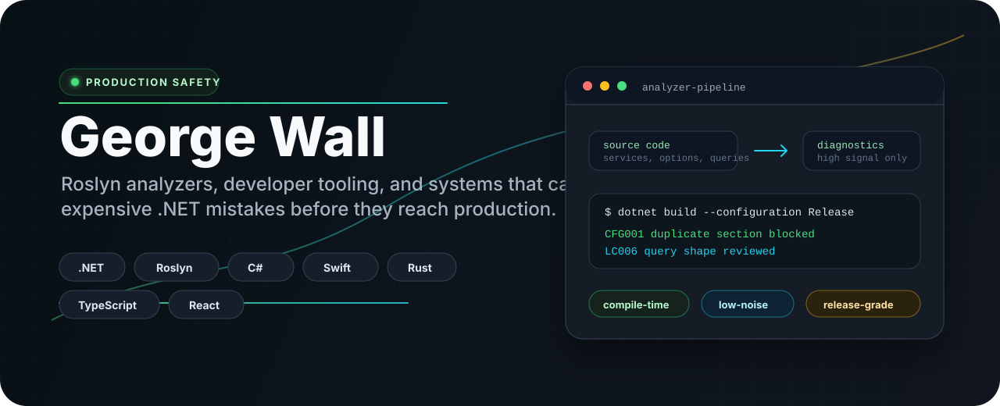

  

  
  
  

## Signal

I build production-safety tooling for .NET teams: Roslyn analyzers, developer workflows, and focused utilities that catch expensive mistakes before they ship.

The thread running through my work is simple: make the failure visible while the developer is still in the editor, keep the diagnostic precise enough to trust, and ship the fix with tests, docs, and release automation.

## Featured Systems

| Project | Focus | Why it matters |
| --- | --- | --- |
| [ConfigContraband](https://github.com/georgepwall1991/ConfigContraband) | Configuration correctness | Catches broken `appsettings`, missing sections, duplicate JSON members, and option-shape drift before runtime. |
| [LinqContraband](https://github.com/georgepwall1991/LinqContraband) | EF Core and LINQ safety | Flags query shapes that cause client-side evaluation, N+1s, cartesian explosions, and costly production behavior. |
| [DependencyInjection.Lifetime.Analyzers](https://github.com/georgepwall1991/DependencyInjection.Lifetime.Analyzers) | Dependency injection lifetimes | Detects captive dependencies, unsafe scopes, and lifetime mismatches that usually fail late. |
| [CancelCop.Analyzer](https://github.com/georgepwall1991/CancelCop.Analyzer) | CancellationToken discipline | Keeps cancellation flowing through public APIs, handlers, EF Core, HTTP calls, and Minimal APIs. |
| [automapper-analyser](https://github.com/georgepwall1991/automapper-analyser) | Mapping safety | Moves AutoMapper configuration failures from runtime surprises into compile-time feedback. |
| [CPMigrate](https://github.com/georgepwall1991/CPMigrate) | Package management | Helps .NET solutions move to Central Package Management with dependency health checks and rollback. |

## Toolbox

  
  
  
  
  
  
  
  
  
  

## Current Bias

- High-signal analyzers over noisy rule volume.
- Runtime failures converted into compile-time feedback.
- Developer-facing diagnostics that explain the fix, not just the failure.
- Small packages that are documented, tested, versioned, and releasable.

## Working Style

I like boring reliability, fast feedback, clean diagnostics, and tools that pay for themselves the first time they stop a bad deploy.
